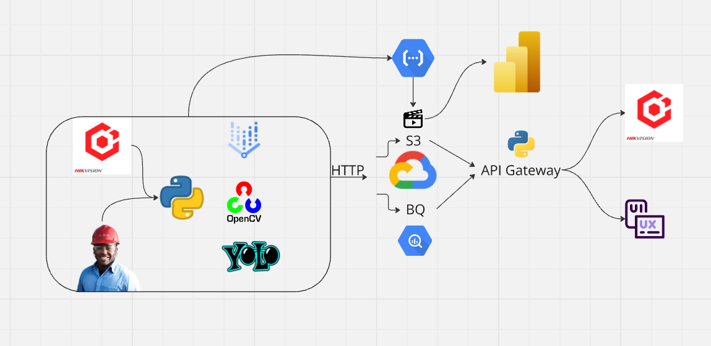

# Introduction

In this initial version of the architecture, **computer vision** and **deep learning** are used to detect workers who are not properly wearing their safety helmets. The system processes images in real-time, stores relevant data, and generates reports for monitoring.

## System Architecture

The SIMPATIA architecture can be divided into three main stages:

### 1. Image Capture and Processing

- **HikVision cameras** are responsible for capturing images of workers in the industrial environment.
- The images are processed using **Python**, **OpenCV**, and the **YOLO** model, which is specifically trained to identify people without helmets.
- The model training pipeline is conducted on **Vertex AI (Google Colab)**.

### 2. Model Execution and Storage

- The code running the EPI detection model will be deployed in a **Cloud Function** for continuous real-time image processing.
- Processed frames will be stored in an **S3 bucket** on Google Cloud.
- **Metadata** generated (such as timestamp, worker identification, and EPI status) will be stored in **BigQuery (BQ)** for future analysis.

### 3. Monitoring and Notifications

- Images of detected incidents will be sent to a **Power BI report**, allowing for the tracking of non-compliance events.
- Whenever an instance of improper EPI use is detected, there are two possible actions:
  - Integration with the **HikVision API** for automatic notifications.
  - Development of a **UX/UI frontend** for alert visualization and management.

## Architecture Diagram

Below is the initial architecture diagram of the project:

# Conclusion

This initial version of the SIMPATIA architecture lays the foundation for an intelligent EPI monitoring system, ensuring greater safety in the industrial environment. Future improvements may include expanding detection to other types of EPIs and enhancing the interface for incident management.

---
