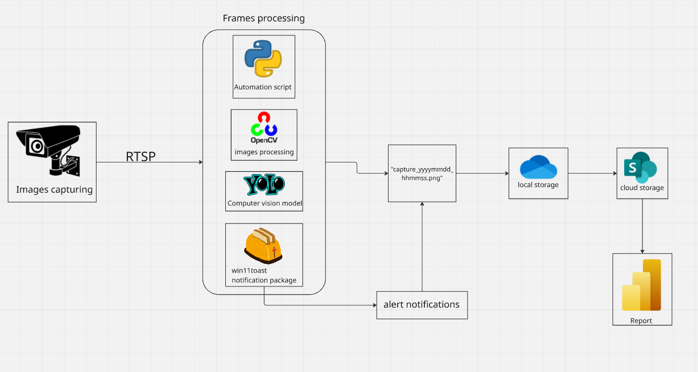

## Introduction

In this updated version of the SIMPATIA architecture, the system leverages **computer vision**, **real-time RTSP streams**, and **Microsoft ecosystem tools** to detect PPE (Personal Protective Equipment) non-compliance. When a worker is not wearing the required gear properly, the system captures and stores the visual evidence and makes it available in a **Power BI dashboard** for monitoring and analysis.

---

## System Architecture

The updated SIMPATIA architecture is composed of the following main stages:

### 1. Image Capturing and Processing

- **Security cameras** stream video using the **RTSP protocol**.
- A Python **automation script** captures these streams and processes the frames using:
  - **OpenCV** for image manipulation,
  - **YOLO model** for detecting PPE violations (e.g., missing helmet, vest),
  - **win11toast** for sending local desktop **notifications** of detected events.

When a violation is detected, a frame is captured and saved locally using the following format:

```
capture_yyyymmdd_hhmmss.png
```


---

### 2. Storage and Integration with Microsoft 365

- Captured frames are first saved to a **OneDrive-synced folder** (local storage).
- This folder is connected to **SharePoint (cloud storage)**, enabling seamless access by external tools like Power BI.

---

### 3. Visualization in Power BI

The Power BI report connects directly to the SharePoint folder and provides:

- **Image metadata extraction** via filename parsing (timestamp from image name).
- **ETL pipeline** inside Power BI to build a structured dataset.
- **Interactive filters** to select violations by **date and time**.
- A **chart** showing the number of violations per time interval.
- A **visual panel** to display the selected frame image for detailed analysis.

This dashboard enables managers and safety teams to **track non-compliance trends** and take proactive action.

---

## Architecture Diagram

Below is the current version of the system diagram:



---

# Conclusion

This current architecture version focuses on lightweight integration with Microsoft's ecosystem and real-time detection of EPI violations using AI. It offers a simple but powerful way to visualize and respond to safety compliance issues, and it's ready to scale with future features like extended EPI detection, real-time alert platforms, or advanced analytics on worker behavior.

