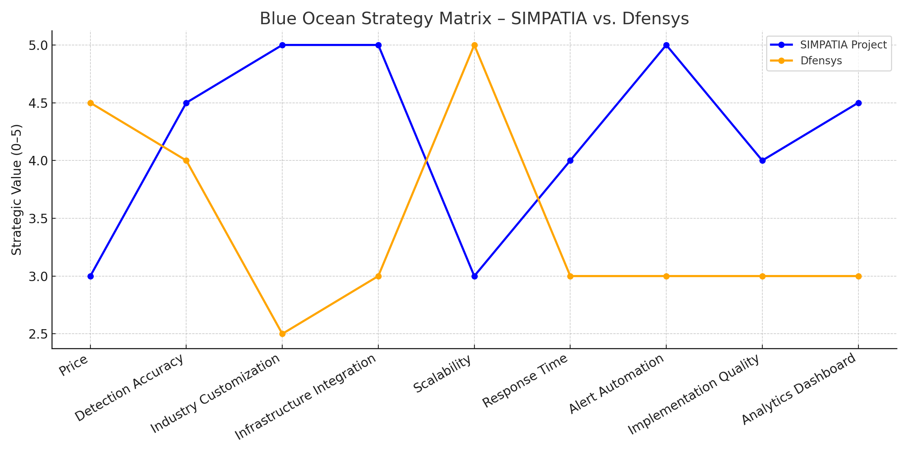

# Introduction

The Blue Ocean Analysis is a business strategy tool designed to create new market spaces, free from direct competition, rather than competing in existing markets. It focuses on identifying and exploring unmet market opportunities, redefining the rules of the game, and generating new demand. This is achieved by analyzing different attributes that can differentiate a product or service in the market.

In the context of the SIMPATIA project, the Blue Ocean Matrix analysis helps identify nine attributes important to Atvos clients that will differentiate the product from competitors through the actions of "Reduce, Eliminate, Raise, and Create." Each attribute is evaluated by comparing the proposed project to the current model represented by the [Dfensys](https://dfensys.com.br/) solution.

## Strategic Attributes and Actions

1. **Price (Reduce)**: SIMPATIA offers a leaner and more affordable structure, especially suited for industrial environments with limited budgets, reducing acquisition costs.

2. **Detection Accuracy (Raise)**: Emphasis on EPI detection accuracy through models trained specifically for the agricultural-industrial context.

3. **Industry Customization (Create)**: Introduces the ability to customize the AI based on the specific EPIs and internal regulations of the plant—something generic solutions don’t offer.

4. **Infrastructure Integration (Raise)**: The system is designed to integrate easily with existing RTSP cameras and internal infrastructure at Atvos.

5. **Scalability (Reduce)**: By focusing on a tailor-made solution, the project intentionally reduces horizontal scalability to prioritize performance in a niche context.

6. **Response Time (Raise)**: Real-time detection and alerting improve agility compared to current solutions that have higher latency or rely on post-event analysis.

7. **Alert Automation (Create)**: Creation of an automated alert system integrated with internal panels or mobile devices of safety managers.

8. **Ease of Deployment (Raise)**: As an internal solution without dependence on proprietary hardware, SIMPATIA offers simpler and more cost-effective deployment.

9. **Analytical Dashboard (Create)**: Development of sector-specific dashboards with visual safety indicators, not available in standard solutions.

## Conclusion

These actions help highlight the attributes where the SIMPATIA project sets itself apart from the competition—whether by reducing disadvantages, eliminating inefficiencies, enhancing key functionalities, or creating new benefits tailored to Atvos. This supports a unique value proposition and guides strategic decisions for product development and marketing.
