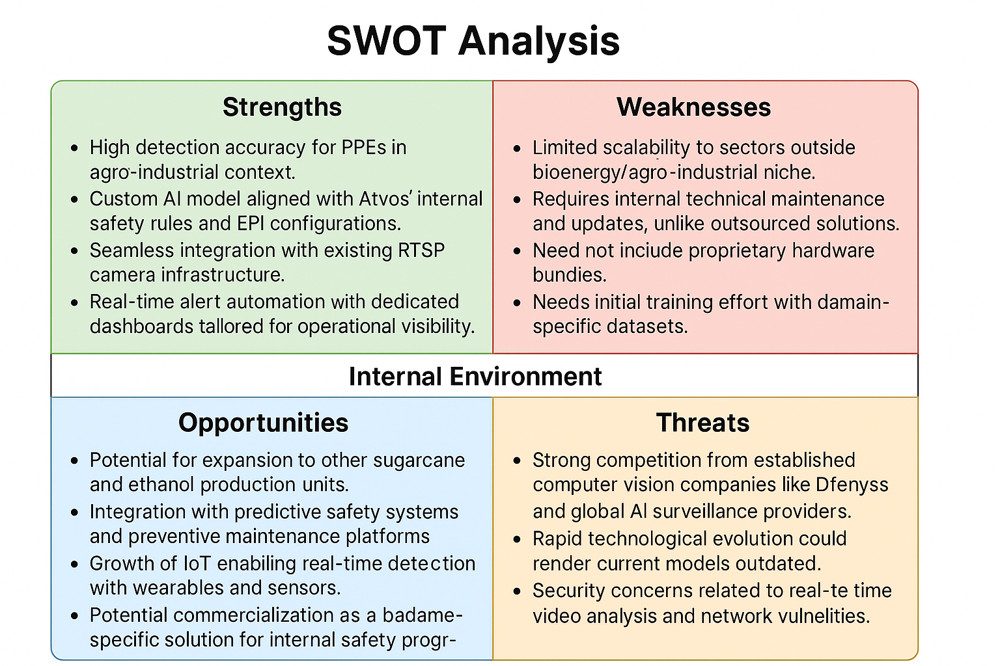

# SWOT Analysis – SIMPATIA Project

The SWOT analysis is a strategic planning tool used to identify the **Strengths, Weaknesses, Opportunities, and Threats** related to a project or business. It helps organizations understand both internal and external factors that can influence the success or failure of a solution.

In the case of the **SIMPATIA Project**, this analysis allows for a strategic comparison against existing computer vision solutions in the market, highlighting its competitive edge in the context of agro-industrial safety monitoring.

## Internal Environment Product: Strengths and Weaknesses

### **Strengths**
- High detection accuracy for PPEs in the agro-industrial context.
- Custom AI model aligned with Atvos' internal safety rules and EPI configurations.
- Seamless integration with existing RTSP camera infrastructure.
- Real-time alert automation with dedicated dashboards tailored for operational visibility.

### **Weaknesses**
- Limited scalability to sectors outside the industrial niche.
- Requires internal technical maintenance and updates, unlike outsourced solutions.
- Does not include proprietary hardware bundles.
- Needs initial training effort with domain-specific datasets.

## External Environment Products: Opportunities and Threats

### **Opportunities**
- Potential for expansion to other monitoring analysis.
- Integration with predictive safety systems and preventive maintenance platforms.
- Growth of IoT enabling real-time detection with wearables and sensors.
- Potential commercialization as a white-label solution for internal safety programs.

### **Threats**
- Strong competition from established computer vision companies like Dfensys and global AI surveillance providers or other computer vision tools.
- Rapid technological evolution could render current models outdated.
- Security concerns related to real-time video analysis and network vulnerabilities.
- Dependence on external factors like camera quality and environmental lighting.

---

---

This SWOT matrix supports strategic decision-making by showing how the SIMPATIA Project stands out and where it should focus to strengthen its market position and avoid potential risks.
