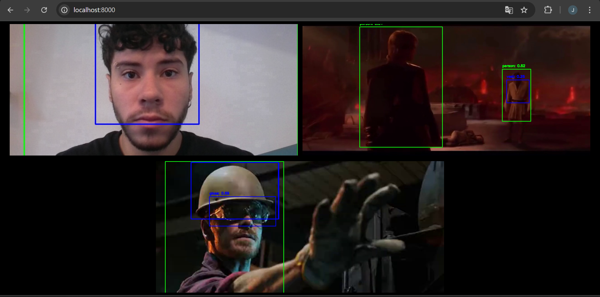

# Introduction  

This page details the functionality of the [code](https://github.com/Inteli-College/2025-1A-T03-G34-INTERNO/blob/dev/SIMPATIA/src/interface/backend/main.py) responsible for **video streaming** and display in a web interface. The main goal is to visualize images captured by cameras in real-time and apply **computer vision** to identify personal protective equipment (PPE).  

Since integration with the **HikVision** API is not yet available, **local video files** and **webcams** are used for testing purposes.

---

## Technologies Used  

The application combines several technologies to capture, process, and display the videos:  

- **Python (FastAPI)**: Framework for creating APIs and managing WebSockets.  
- **OpenCV**: Library for image and video manipulation.  
- **YOLO (You Only Look Once)**: Deep learning model for object detection.  
- **WebSockets**: Technology for real-time data transmission.  
- **Base64**: Encoding of images for efficient transmission via WebSocket.  
- **HTML + JavaScript**: Web interface for displaying the streaming.

---

## Code Structure  

### 1. **Model Setup**  
```python
model_path = "../../app/bin_model/best.pt"
model = YOLO(model_path)
```

The trained YOLO model is loaded from the path `best.pt`.

### 2. **Camera Definitions**
```python
camera_urls = [
    0, 
    "../../app/teste1.mp4",
    "../../app/teste2.mp4"
]
```

The real cameras are replaced with test videos and the webcam.

### 3. **Video Processing and Object Detection**
```python 
results = model.predict(frame)
for bbox in results[0].boxes:
    x1, y1, x2, y2 = map(int, bbox.xyxy[0])
    conf = bbox.conf[0]
    cls = int(bbox.cls[0])
    class_name = model.names[cls]

    color = (0, 255, 0) if class_name == "person" else (255, 0, 0)
    cv2.rectangle(frame, (x1, y1), (x2, y2), color, 2)
    label = f"{class_name}: {conf:.2f}"
    cv2.putText(frame, label, (x1, y1 - 10), cv2.FONT_HERSHEY_SIMPLEX, 0.5, color, 2)
```

The YOLO model processes each frame, drawing bounding boxes around detected objects.

### 4. **WebSocket Streaming**
```python 
await websocket.send_text(frame_b64)
```

Each frame is converted to Base64 and sent to the client.

### 5. **Web Interface**
```html

```

Each video is dynamically loaded via WebSockets, displaying the processed frames in real-time.



# Conclusion

This implementation enables real-time visualization of the cameras, providing a solid foundation for future improvements and integration with the HikVision API. The initial need to display the videos has been met, allowing for adjustments to the model before full adoption of the solution at Atvos.
