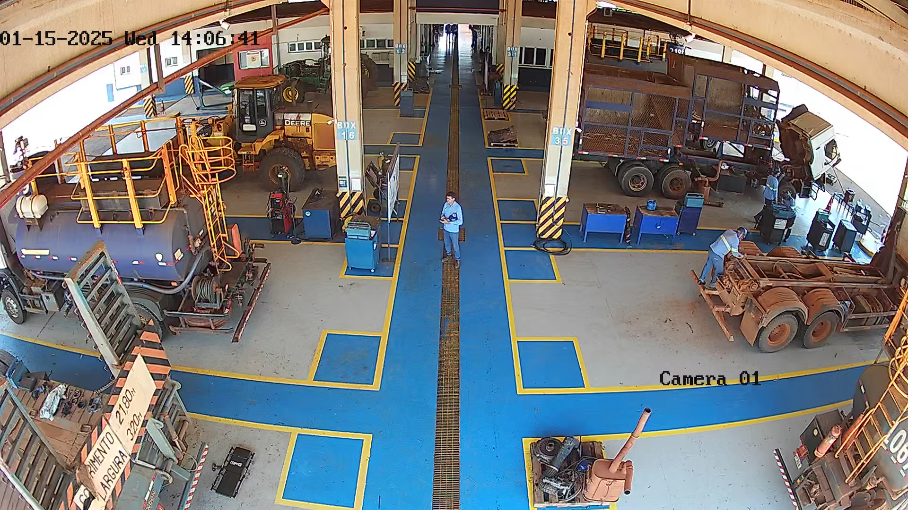
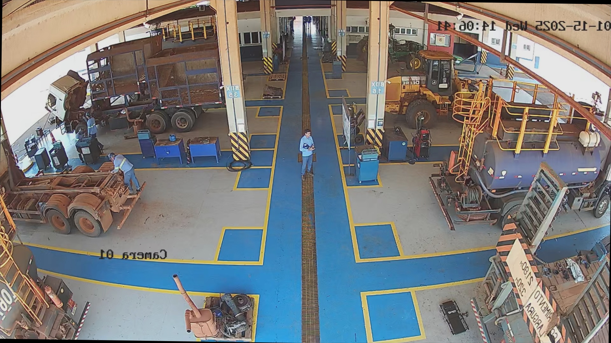

## 1. Context

During the development of computer vision models, the availability and balance of the dataset are crucial factors for achieving high accuracy and generalization. 

In our project, aimed at detecting the correct use of Personal Protective Equipment (PPE), we face a significant **class imbalance problem**. The majority of captured images represent people **wearing PPE correctly**, while only a small fraction shows people **without PPE**, especially without helmets.

This imbalance could lead the model to be biased towards the majority class, significantly reducing detection accuracy in the minority class (people without PPE).

---

## 2. Importance of Data Augmentation

**Data Augmentation** is a fundamental technique that consists of applying transformations to existing images to synthetically increase the dataset size and diversity.

### Benefits:

-  Balances minority classes.
-  Increases dataset variability (lighting, position, orientation, blur).
-  Reduces overfitting.
-  Improves model generalization to real-world conditions.

>  Without Data Augmentation, the model would likely become overfitted to the dominant class and fail to detect the absence of PPE in edge cases.

---

## 3. Application in the Project

Given the imbalance in our dataset, Data Augmentation was specifically applied to images of the minority class, namely the **"head without helmet"** class.

By generating new variants of these images through random transformations, we significantly increased the number of samples representing non-compliance with PPE usage.

This step is crucial for training a robust detection model capable of handling varying real-world conditions, such as:

- Different camera angles.
- Variations in lighting.
- Slight rotations and misalignments.
- Image noise or blur.

---

## 4. Code Explanation

###  Script Overview

This script performs Data Augmentation on the **"heads"** folder, containing images of the minority class (e.g., no helmet), and saves the augmented images in the **"headsaug"** folder.

###  Code

```python
import cv2
import os
import albumentations as A

# Input and output directories
input_dir = "heads"
output_dir = "headsaug"

# Create output directory if it doesn't exist
os.makedirs(output_dir, exist_ok=True)

# Define augmentation pipeline
transform = A.Compose([
    A.RandomCrop(width=1920, height=1080),
    A.HorizontalFlip(p=0.5),
    A.RandomBrightnessContrast(p=0.2),
    A.GaussianBlur(blur_limit=(3, 7), p=0.2),
    A.Rotate(limit=10, p=0.3)
])

# List of images in the input folder
images = [f for f in os.listdir(input_dir) if f.endswith((".jpg", ".png", ".jpeg"))]

# Loop through each image
for image_name in images:
    image_path = os.path.join(input_dir, image_name)
    image = cv2.imread(image_path)

    if image is None:
        print(f"Error loading {image_name}, skipping...")
        continue

    # Apply transformations
    augmented = transform(image=image)["image"]

    # Save without overwriting
    idx = 1
    while True:
        output_filename = f"nocapaug{idx}.jpg"
        output_path = os.path.join(output_dir, output_filename)

        if not os.path.exists(output_path):
            cv2.imwrite(output_path, augmented)
            print(f"Saved: {output_path}")
            break

        idx += 1

print("Data augmentation completed! ")
```

## Transformations Breakdown

| Transformation                               | Description                                                        |
| --------------------------------------------- | ------------------------------------------------------------------ |
| `RandomCrop(width=1920, height=1080)`        | Simulates camera zoom or repositioning by cropping a random area.  |
| `HorizontalFlip(p=0.5)`                      | 50% chance to mirror the image horizontally.                       |
| `RandomBrightnessContrast(p=0.2)`            | Adds random lighting and contrast variations.                      |
| `GaussianBlur(blur_limit=(3, 7), p=0.2)`     | Simulates blur, out-of-focus, or low-quality cameras.              |
| `Rotate(limit=10, p=0.3)`                    | Random rotation up to ±10 degrees to simulate different angles.    |

---

## Folder Structure

```bash
dataset/
├── heads/        # Original minority class images (no helmet)
├── headsaug/     # Augmented images generated
└── data_augmentation.py  # Script file
```
---

## Images example comprehension 






---

## 5. Final Considerations

The Data Augmentation process is an essential step to mitigate the imbalance between classes in this project. By synthetically increasing the dataset of the minority class, the model is expected to:

- Improve detection accuracy of PPE absence.

- Reduce false negatives for critical safety violations.

- Generalize better across different environments, cameras, and operational conditions.