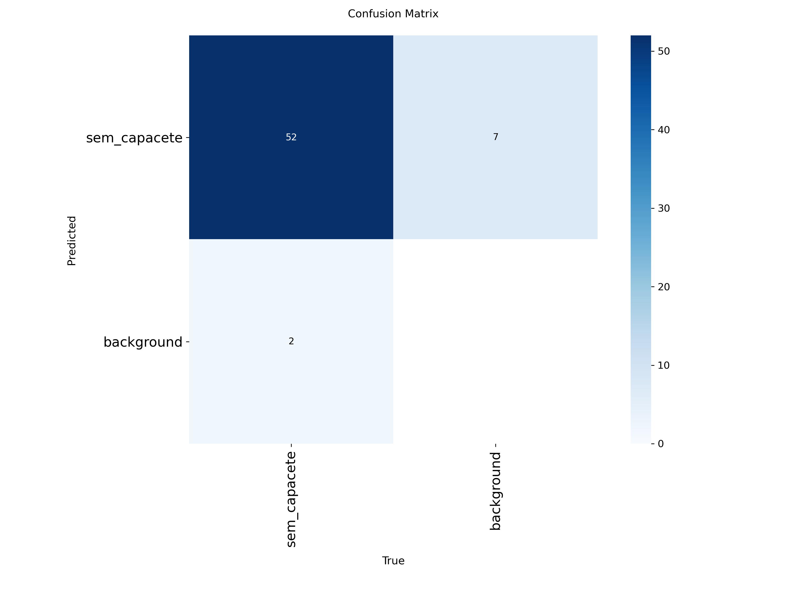
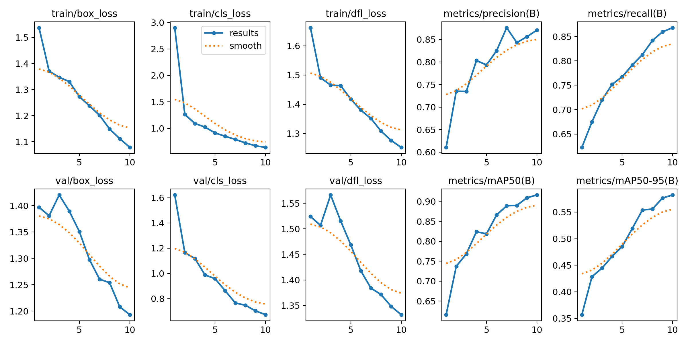

# Initial Model Training Analysis - Atvos PoC

This document presents the initial training analysis of the PPE (Personal Protective Equipment) detection model developed in the **SIMPATIA** project.  
The objective of this sprint was to establish a **proof of concept (PoC)** to validate the model architecture and confirm the feasibility of training with the available dataset.  

The dataset used in this experiment was limited in size and variation, but sufficient to evaluate the learning capacity of the YOLOv8 model and define the baseline for further improvements.

---

## Training Overview

- **Platform**: Google Colab  
- **Framework**: YOLOv8 (Ultralytics)  
- **Model**: `yolov8s.pt` (pretrained)  
- **Hardware**: Tesla T4 GPU (CUDA)  
- **Dataset**: Atvos PPE dataset (`/content/final_dataset_para_yolo/data.yaml`)  
- **Image Size**: 800 × 800  
- **Epochs**: 20  
- **Optimizer**: Auto (Ultralytics default)  
- **Model Size**: 11.1M parameters, 28.4 GFLOPs  

---

## Validation Metrics

After 20 epochs, the model was evaluated on the validation set. The results confirmed the architecture’s ability to generalize, even with a limited dataset.

| Metric        | Value   |
|---------------|---------|
| Precision (P) | 0.943   |
| Recall (R)    | 0.944   |
| mAP@0.5       | 0.935   |
| mAP@0.5:0.95  | 0.580   |

These results demonstrate a good balance between **Precision** (avoiding false positives) and **Recall** (capturing all true detections). The high mAP@0.5 score validates the model’s effectiveness for the PoC stage.

---

## Key Outputs & Artifacts

**Confusion Matrix**  
The confusion matrix indicates very low misclassification between the `no-helmet` class and background, confirming accurate detection capability.  

**Performance Graphs**
The training curves for Precision and Recall remained stable across epochs, indicating no overfitting in this initial run.

# Conclusion

The initial training run was successful and achieved high accuracy, validating YOLOv8 as a robust architecture for the Atvos PPE detection use case. The generated artifacts, including the confusion matrix and training curves, confirm the stability of the training pipeline.

**Artifacts generated in this sprint:**

- Training notebook: Atvos_dataset_yolov8_training.ipynb

- Trained weights: best_yolo_atvos.pt

**Next Steps:**

- Expand the dataset with more diverse and real-world images from plant cameras.

- Retrain the model at larger scale to improve generalization.

- Prepare the model for integration into the real-time MVP pipeline (FastAPI + Power BI).